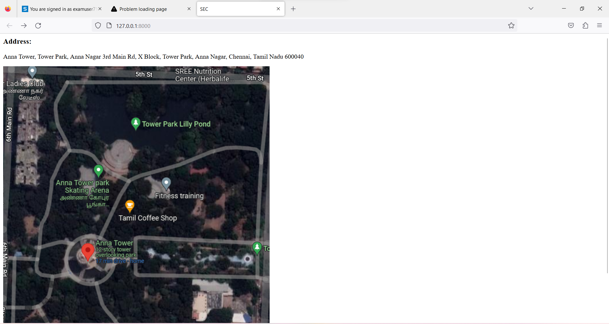

# Places Around Me
## AIM:
To develop a website to display details about the places around my house.

## Design Steps:

### Step 1:
Create a new django project and app
### Step 2:
Add a new imagemap html file in templates and neede images in static folder and define it in settings.
### Step 3:
Type ur image map code in the html with coordinates and target file to redirect on click
### Step 4:
Define your components pages and create content in such a way that it gives information about place which is being clicked
### Step 5:
Include pictures and contents for your subpages and map them using urls and views
## Code:
```



<html>
    <head>
        <title>SEC</title>
        <link rel="stylesheet" type="text/css" href="">
    </head>
    <body>

        <h3>Address:</h3><p> Anna Tower, Tower Park, Anna Nagar 3rd Main Rd, X Block, Tower Park, Anna Nagar, Chennai, Tamil Nadu 600040</p>
        

<map name="image-maps-2023-01-18-075255" id="ImageMapsCom-image-maps-2023-01-18-075255">
<area id="pond" alt="" title="" href="pond" shape="rect" coords="160,0,672,209" style="outline:none;" target="_self"     />
<area id="skatingarea" alt="" title="" href="skatingarea" shape="rect" coords="144,237,269,400" style="outline:none;" target="_self"     />
<area id="fitnesstraining" alt="" title="" href="fitnesstraining" shape="rect" coords="353,266,588,350" style="outline:none;" target="_self"     />
<area id="entrance" alt="" title="" href="entrance" shape="rect" coords="332,441,672,525" style="outline:none;" target="_self"     />
<area id="towerclub" alt="" title="" href="towerclub" shape="rect" coords="474,537,660,771" style="outline:none;" target="_self"     />
<area shape="rect" coords="670,769,672,771" alt="Image Map" style="outline:none;" title="Image Map" href="#" />
</map>


    </body>
</html>


```

## Output:


## Result:
Thus a website is developed to display details about a park near my house .